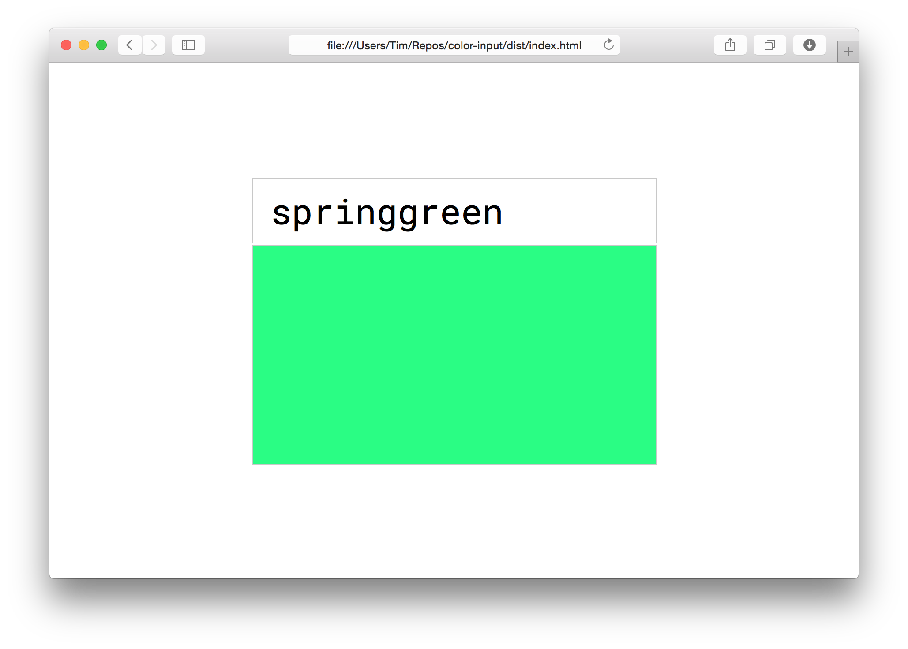

# Color Input
One input, one color.



### Instructions

In order to view this project you must first compile it. This can be done in a couple quick steps:

```
npm install
npm run build
```

After the project has finished installing and building, you should see a `dist` folder. Inside this folder there will be an `index.html`, which is the entry point of the project.